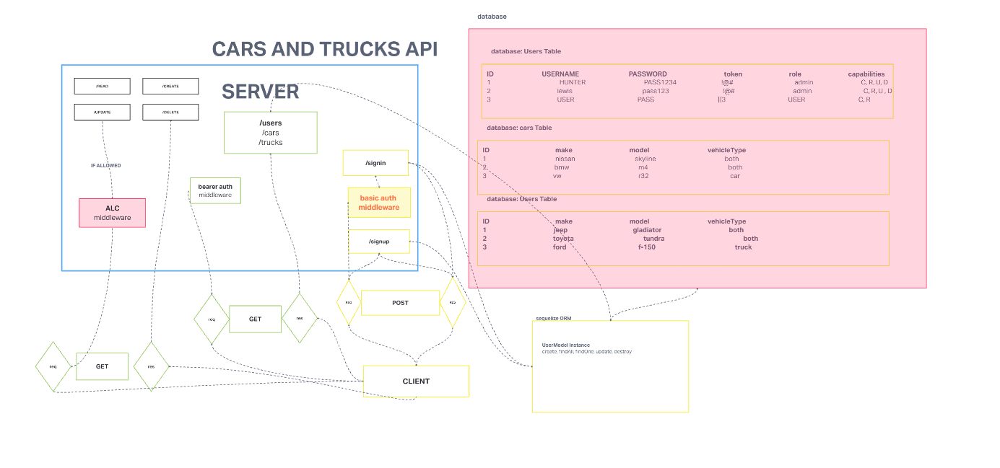

# LAB - 401-D49 Lab-09

## Project: auth-api

### Author: Lewis Benson, Hunter Fehr

### Problem Domain

We would like to view cars or trucks depending on user preference. If a user prefers cars, they will gain access to a list of cars. If a user prefers trucks they will gain access to a list of trucks.

### Links and Resources

- [ci/cd](https://github.com/d49-lab-09/cars-trucks-api/actions) (GitHub Actions)
- [server-prod](https://d49-cars-trucks.onrender.com/)

### Setup

#### `.env` requirements (where applicable)

see `.env.sample`

#### How to initialize/run your application (where applicable)

- nodemon

#### Features / Routes

- Feature one: Deploy to Prod

- GET : `/` - specific route to hit

- `/signin` : POST - login as user
- `/signup` : POST - create one user
- `/users` : GET - Read all usernames
- `/users` : GET - Read all usernames
- `/users` : GET - Read all usernames
- `/cars` : GET - Read all cars
- `/trucks` : GET - Read all trucks
- `/cars` : POST - Create one cars
- `/trucks` : POST - Create one trucks
- `/cars/:id` : PUT - Update one cars
- `/trucks/:id` : PUT - Update one trucks
- `/cars/:id` : DELETE - Delete one cars
- `/trucks/:id` : DELETE - Delete one trucks

#### Tests

- How do you run tests?
  - npm test
- Any tests of note?
  - handles root path
  - handles invalid paths
  - handles every CRUD function
- Describe any tests that you did not complete, skipped, etc

#### UML

Link to an image of the UML for your application and response to events
